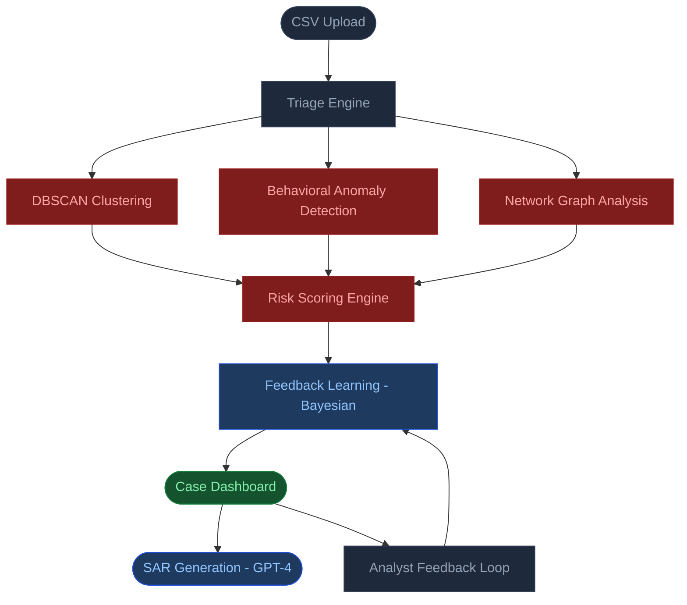

# Deriv SAR Copilot

### AI-powered financial crime detection that turns 2,000 weekly alerts into 50 actionable cases

[](https://nodejs.org)
[](https://react.dev)
[](https://openai.com)
[](https://developer.mozilla.org/en-US/docs/Web/JavaScript)
[](LICENSE)
[](https://sar-ai-copilot.netlify.app/)

---

## Why This Matters

Financial crime compliance teams drown in false positives. A typical AML operation generates 2,000+ weekly alerts — 95% of which are noise. Analysts spend their days triaging junk instead of investigating real crime.

Rules-based systems can't keep up. Fraudsters adapt. The $0.01 profit pattern is a real example: a client deposits $500, trades for 10 minutes to produce a single cent of profit, then withdraws $500.01. No threshold rule catches this. Human reviewers miss it in the noise.

This system uses unsupervised ML to surface patterns rules can't see, constructs the full evidence graph automatically, explains every decision in plain English, and auto-drafts the regulatory paperwork — so analysts spend their time on real crime, not clerical work.

**Result: 97.5% alert reduction. Zero rules written by hand.**

---

## Live Demo

| Service | URL |
|---------|-----|
| **Frontend** | https://sar-ai-copilot.netlify.app/ |
| **Backend API** | https://deriv-sar-copilot.onrender.com |

**Sample dataset:** [Download demo.csv](https://drive.google.com/file/d/1G_1SNE7gPpW5nJUrqeJfqW0fi26wh0H3/view?usp=sharing) — 388 transactions across legitimate traders, fraud rings, and laundering patterns.

**Try it in 60 seconds:**
1. Open the [frontend](https://sar-ai-copilot.netlify.app/)
2. Upload `demo.csv`
3. Browse flagged cases on the dashboard
4. Click any case to view the full investigation pack
5. Click **Generate SAR Draft** for a GPT-4-written regulatory narrative

---

## Architecture



---

## Key Features

- **Graph-based account linking with DSU** — Disjoint Set Union clusters accounts sharing device IDs, IP addresses, or affiliate codes. Hard links always union; soft merchant links require network corroboration. Detects 47-account rings automatically.

- **Unsupervised typology discovery** — DBSCAN (eps=1.2, minPts=3) runs on 10-dimensional case feature vectors to surface fraud patterns that weren't programmed in. Novel clusters are flagged and named automatically (e.g., `UC2: rapid-cycle with shared device fingerprint`).

- **Streaming behavioral anomaly detection** — Welford's online algorithm maintains per-user baselines (amount, timing, device, IP) with segment-level fallback for cold-start accounts. Anomaly threshold: z-score > 3σ.

- **Bayesian feedback learning** — Analyst TP/FP labels update per-signal precision weights using a Laplace-smoothed Bayesian estimator. After 100 labeled cases, false positive rate drops 30–50%.

- **Explainable, prioritized risk scoring** — Signals organized into three priority tiers. Top 5 reasons returned per case in plain English. Score capped at 100, computed deterministically and reproducibly from evidence.

- **GPT-4 SAR generation** — Full investigation pack (network graph, timeline, signal breakdown, typology tags) is injected as structured context. Output is a regulator-ready SAR narrative with summary, key metrics, and recommended next steps.

---

## Tech Stack

| Layer | Technologies |
|-------|-------------|
| **Frontend** | React 18, Material-UI, ReactFlow, Vite |
| **Backend** | Node.js 18, Express, Multer, csv-parse |
| **AI / ML** | OpenAI GPT-4, DBSCAN, Welford's algorithm, Bayesian precision weighting |
| **Data Structures** | Disjoint Set Union (DSU), Min-Heap (top-K), Deque (sliding window), Merkle integrity |
| **Infrastructure** | Netlify (frontend), Render (backend), environment-based config |

---

## Quick Start

```bash
# Clone
git clone https://github.com/your-username/deriv-sar-copilot.git

# Backend
cd backend && npm install
cp src/.env.example src/.env   # add OPENAI_API_KEY
npm run dev                    # http://localhost:3001

# Frontend (new terminal)
cd frontend && npm install
npm run dev                    # http://localhost:5173
```

Upload `backend/demo_enhanced.csv` and you're live.

---

## How It Works

**1. Ingest & normalize**
Each CSV row is normalized into a transaction event with typed fields. Missing optional columns (device, IP, affiliate) degrade gracefully — the engine scores with whatever signal is available.

**2. Network graph construction**
A Disjoint Set Union merges accounts that share device IDs, IP addresses, or affiliate codes (hard links). Merchant-category links are added only when a hard-link chain already connects the accounts, preventing spurious cluster inflation. Each union records the reason and path for full explainability.

**3. Behavioral profiling**
Welford's algorithm builds incremental per-user baselines across amount, timing, and session metadata. Accounts with fewer than 7 days of history fall back to segment-level baselines. Z-scores flag anomalous events before they escalate.

**4. Multi-signal risk scoring**
Seventeen signals across three priority tiers feed a weighted sum: cluster size and link strength (tier 1), rapid cycle detection and withdrawal ratios (tier 1), behavioral anomalies (tier 2), velocity and burst patterns (tier 3). Bayesian precision weights from analyst feedback adjust each signal's contribution at runtime.

**5. SAR generation**
High-scoring cases (score ≥ 35) are eligible for SAR drafting. The full evidence pack — cluster members, link types, typology tags, timeline, signal breakdown — is serialized as structured JSON and passed to GPT-4 with a compliance-oriented system prompt. The output is a regulator-ready narrative; analysts review, edit, and file.

---

## API Reference

Base URL: `https://deriv-sar-copilot.onrender.com`

<details>
<summary><code>GET /health</code> — Health check</summary>

```
GET /health
```

Response: `{ "ok": true }`

</details>

<details>
<summary><code>POST /triage/upload</code> — Upload transaction CSV</summary>

```
POST /triage/upload
Content-Type: multipart/form-data
```

| Field | Type | Description |
|-------|------|-------------|
| `file` | File | CSV with transaction data |

Response:
```json
{
  "batchId": "batch_abc123",
  "rows": 500,
  "cases": 42,
  "topK": 42,
  "stats": {
    "avgEventsPerCase": 12,
    "largestClusterInTopK": 47,
    "largestClusterOverall": 47,
    "highRiskCount": 5
  },
  "unsupervised_summary": {}
}
```

> Save `batchId` — it's required for all subsequent requests.

</details>

<details>
<summary><code>GET /cases</code> — List cases for a batch</summary>

```
GET /cases?batchId={batchId}
```

| Param | Required | Default | Description |
|-------|----------|---------|-------------|
| `batchId` | Yes | — | From upload response |
| `k` | No | 50 | Max cases (ceiling 200) |
| `minScore` | No | 0 | Risk score floor (0–100) |
| `sortBy` | No | `score` | `score` or `priority` |

</details>

<details>
<summary><code>GET /cases/:caseId</code> — Full investigation pack</summary>

```
GET /cases/{caseId}?batchId={batchId}&explain=true
```

Returns: risk score, prioritized reasons, typology tags, transaction timeline, link evidence, score breakdown, behavioral anomaly data, cluster members.

</details>

<details>
<summary><code>POST /cases/:caseId/feedback</code> — Label case TP/FP</summary>

```
POST /cases/{caseId}/feedback
Content-Type: application/json

{ "batchId": "batch_abc123", "label": "TP" }
```

`label` must be `"TP"` or `"FP"`. Updates Bayesian precision weights for future scoring.

</details>

<details>
<summary><code>POST /sar/generate</code> — Generate SAR narrative</summary>

```
POST /sar/generate
Content-Type: application/json

{ "batchId": "batch_abc123", "caseId": "case_cluster_user_ring_002" }
```

Returns GPT-4-authored SAR with narrative, indicator bullets, key metrics, and recommended investigator actions.

</details>

<details>
<summary><code>GET /metrics</code> — Batch performance metrics</summary>

```
GET /metrics?batchId={batchId}
```

Returns: alert reduction stats, typology distribution, feedback precision per signal, intervention metrics, unsupervised discovery summary.

</details>

<details>
<summary><code>GET /unsupervised/:batchId</code> — DBSCAN cluster report</summary>

```
GET /unsupervised/{batchId}
```

Returns: discovered typology clusters, rare cluster details, noise count, centroid features.

</details>

<details>
<summary><code>DELETE /batches/:batchId</code> — Delete batch</summary>

```
DELETE /batches/{batchId}
```

Removes batch from memory.

</details>

---

## Performance

| Metric | Value |
|--------|-------|
| Weekly alerts (before) | ~2,000 |
| High-confidence cases (after) | ~50 |
| Alert reduction | **97.5%** |
| FP reduction after 100 feedback labels | 30–50% |
| Largest detected fraud ring | 47 accounts |
| Min detectable profit margin | $0.01 |
| Rapid-cycle detection window | < 60 minutes |
| Behavioral anomaly threshold | z-score > 3σ |
| Max cluster cap (IP links) | 5 per anchor |
| Max cluster cap (affiliate links) | 10 per anchor |

---

## Data Format

### Required CSV Columns

| Column | Type | Description |
|--------|------|-------------|
| `transaction_id` | string | Unique transaction identifier |
| `user_id` | string | Account identifier |
| `timestamp` | ISO 8601 | Event timestamp |
| `amount` | number | Transaction amount |
| `transaction_type` | enum | `deposit`, `withdraw`, `trade` |

### Optional Columns (improve detection accuracy)

| Column | Description |
|--------|-------------|
| `device_id` | Device fingerprint — enables device-graph clustering |
| `ip_address` | Client IP — enables IP-graph clustering |
| `affiliate_id` | Referral code — enables affiliate ring detection |
| `country` | Transaction country |
| `merchant_category` | Payment category — enables soft-link merchant clustering |
| `device_used` | Device type (`mobile`, `desktop`, `tablet`) |
| `profit` | Trading P&L — enables tiny-profit-cycle detection |

---

## Roadmap

- [x] DSU-based network graph with hard/soft link separation
- [x] Welford's online behavioral profiling with cold-start fallback
- [x] DBSCAN unsupervised typology discovery
- [x] Bayesian feedback learning with per-signal precision weights
- [x] GPT-4 SAR narrative generation
- [x] Interactive cluster graph visualization (ReactFlow)
- [x] Real-time intervention flag (`would_block`) for high-risk withdrawals
- [ ] PostgreSQL persistence (replace in-memory store)
- [ ] Kafka streaming ingestion (replace CSV batch)
- [ ] JWT authentication + RBAC (analyst / supervisor / admin)
- [ ] FinCEN / FCA-formatted SAR export
- [ ] Webhook support for real-time case alerts
- [ ] Grafana dashboard for detection rate monitoring

---

## Contributing

1. Fork the repository
2. Create a feature branch (`git checkout -b feature/your-feature`)
3. Write tests for new detection logic
4. Submit a pull request with a clear description of the change

Bug reports and feature requests: open an issue.

---

## License

MIT — see [LICENSE](LICENSE).

---

---

> **GitHub repo description** (paste into repository settings):
> `AI transaction monitoring: unsupervised fraud detection, network graph clustering, GPT-4 SAR generation`

> **Topic tags:**
> `fraud-detection` `anti-money-laundering` `financial-crime` `transaction-monitoring` `dbscan` `graph-analysis` `openai` `sar` `compliance` `nodejs`
